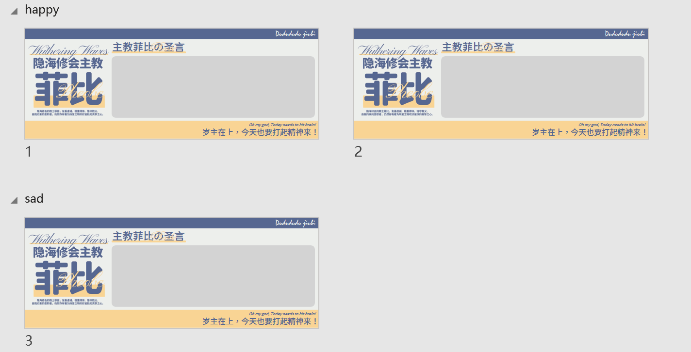

# 将PPTX文件转换为AstrBot传话筒插件立绘差分

## 使用方法

1. **准备PPTX文件**：
   - 创建8:3比例的幻灯片
   - 使用“分节”功能标识不同的立绘差分
   

2. **导出图片**：
   - 将PPT所有页面导出为PNG格式到当前文件夹

3. **运行脚本**：
   - 执行脚本，将导出的图片（如“幻灯片1.png”、“幻灯片2.png”等）转换为传话筒插件支持的character差分格式

4. **部署文件**：
   - 将转换后的文件夹放入传话筒插件的“character”目录中

5. **配置插件**：
   - 在传话筒WebUI中创建一个空白预设
   - 将立绘图层设置在主文本框下方，铺满整个页面
   - 手动配置文本框及字体样式（此步骤暂未实现自动化）

## 相比原生WebUI有什么好处？

1. **排版更方便**：原生WebUI排版比较麻烦，PPT是一种比较简便的替代方式
2. **更多的效果**：PPT支持的所有效果都能用，包括但不限于边框/投影/布尔/渐变等等。
3. **更多差分**：本来背景和其他对象是不支持情绪差分的，但是全部都当作立绘处理的话（整张图都是立绘），可以对不同情绪自定义其他部分的内容。

## 实现原理

通过解析PPTX文件（实际为压缩包）内的XML结构，识别分节信息并与导出的PNG图片进行匹配。随后重新组织文件夹结构，将处理后的图片适配至传话筒插件的立绘系统。

实际上这个脚本主要解决了PPT导出不带文件夹结构的问题。

## 注意事项

1. **功能限制**：
   - 当前仅支持单图层输出
   - 由于python-pptx库版本较旧，未支持分节功能解析，因此开发多图层配置较为复杂
> 替代方案也是有的，使用两帧PPT层叠，将“主文本框”夹在中间即可，此功能亟待开发。

2. **图片规格**：
   - 传话筒插件要求立绘图片比例为8:3

3. **图片质量**：
   - 未经设置的PPT导出可能图片模糊，请参考
   [如何从PowerPoint导出高分辨率幻灯片](https://learn.microsoft.com/zh-cn/office/troubleshoot/powerpoint/change-export-slide-resolution)
   进行相关配置，可以直接将键值修改到1000以获得足够高清的素材

---

**PPT素材来源**：Bilibili@二五母鸡卡